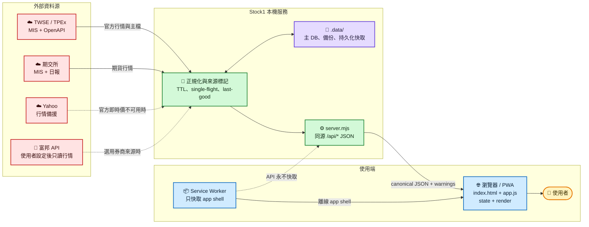
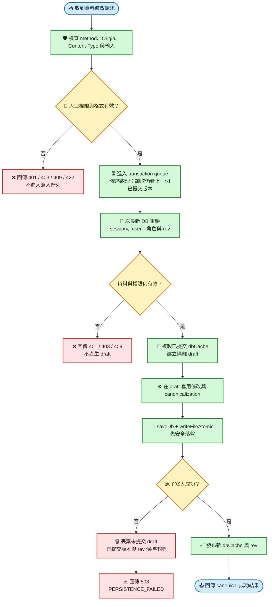
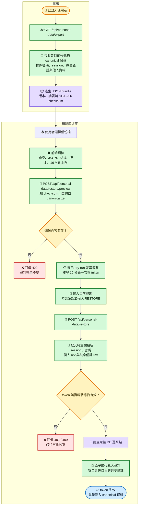

# Stock1 台股看盤 Web App

Stock1 是一套以私人自架為出發點的繁體中文台股看盤 Web App，整合官方行情、盤中與策略選股、技術分析、處置資訊及個人交易紀錄。券商 provider 目前只讀取行情，不提供下單、改單、庫存或帳務操作。

> [!IMPORTANT]
> 本專案僅供行情整理、策略觀察與程式研究，不構成投資建議。行情與選股結果可能受官方資料延遲、來源中斷或估算規則影響；任何交易決策、費稅與損益都應再以交易所公告及券商對帳資料確認。

## 核心功能

- TWSE、TPEx 與期交所官方資料整合，並保留來源狀態、日期與降級警告。
- 隔日沖、盤中選股與波段策略雷達，搭配前向驗證與風險標記。
- 自選股、到價提醒、日／週／月技術圖、基本面與注意／處置看板。
- 多帳號登入、個人交易帳本 v2、股利紀錄，以及個人資料備份與復原。
- PWA app shell 與自架圖示／字型；離線時不會把舊行情冒充即時資料。

## 系統架構與主要流程

以下三張圖分別說明行情如何進入畫面、資料修改如何安全落盤，以及個人資料如何匯出與復原。這些是導覽層級的摘要；實際端點、資料契約與安全邊界仍以後續章節為準。

### 行情與畫面資料流



### 安全寫入與持久化



### 備份、預覽與復原流程



獨立的 Mermaid 原始檔與通過 CLI 渲染的 SVG 保存在 [`diagrams/`](diagrams/)；修改圖表時應同步更新 README 內的 Mermaid 區塊。

## 本機啟動

需要 Node.js 20.19+、22.13+ 或 24+（測試環境使用的 jsdom 也遵循相同版本範圍）。

```powershell
npm ci
npm start
```

想先確認目前環境與程式碼可正常運作，可執行完全離線的測試：

```powershell
npm test
```

開啟：

```text
http://127.0.0.1:5174/
```

第一次啟動會自動建立管理者帳號：

```text
帳號：admin
密碼：admin1234
```

部署前一定要用環境變數改掉預設密碼。

## 主要環境變數

```text
NODE_ENV=production
HOST=0.0.0.0
PORT=5174
APP_SECRET=請放一組長且不可外流的隨機字串
ADMIN_USERNAME=admin
ADMIN_PASSWORD=請改成強密碼
PUBLIC_ORIGIN=https://你的正式網域
COOKIE_SECURE=true
DATA_DIR=/var/app/data
DB_PATH=/var/app/data/stock1-db.json
```

`APP_SECRET` 會用來加密券商 API 設定。正式使用後不要任意更換，否則已儲存的券商設定會無法解密。`NODE_ENV=production` 時必須使用至少 12 字元的 `ADMIN_PASSWORD` 與至少 32 字元的 `APP_SECRET`；即使不是 production，只要 `HOST` 對外綁定（例如 `0.0.0.0`／`::`）或設定了 `PUBLIC_ORIGIN`，也會套用相同強度要求並拒絕範例值。`PUBLIC_ORIGIN` 用來鎖定資料修改 API 的正式同源網址；只有純 loopback、未設定公開來源的本機開發模式可沿用開發預設。

`DB_PATH` 可省略；預設為 `DATA_DIR/stock1-db.json`。若自訂，父目錄必須在啟動前存在，canonical DB 路徑也必須留在 canonical `DATA_DIR` 內。主 DB 的任一 path segment 不可是 `backups`，也不可等於三個持久化 sidecar 或其 `.tmp` 保留名稱；DB 本身另不可是 symbolic link、目錄／其他非一般檔案或多重 hard link。不符合時伺服器會 fail-closed 拒絕啟動。`DATA_DIR` 可以是尚未建立的單一 leaf，但它的 immediate parent 必須已存在且為目錄，不能靠遞迴 `mkdir` 穿過另一 writer 尚未建立的 file／temp resource。`DATA_DIR/backups` 本身必須是該名稱的真實 canonical directory，不接受 symlink／junction alias（包含 dangling link）或一般檔案。

## 服務健康與安全關機

`GET /api/health` 是免登入、只接受 GET 的 readiness 端點，會回傳服務狀態、版本、啟動時間、運作秒數與尚未完成的持久化寫入數。服務完成資料庫初始化並可接請求時回 `200`；尚未 ready 或正在停止時回 `503`，可供反向代理或雲端平台做健康檢查。

伺服器收到 `SIGINT`／`SIGTERM` 時會先停止接受新連線，等待既有請求完成，再排空資料庫、原子寫入、背景快取與股利資料等持久化工作，最後關閉券商行情 session。安全關機失敗會留下非零結束碼，不會用強制退出略過尚未落盤的資料。

所有執行期間的主資料庫修改都走同一條 **copy-on-write transaction queue**，依序完成「重新檢查條件與 rev → 在隔離 draft 套用修改 → 原子落盤 draft → 成功後才發布成新的 `dbCache`」。所有需登入的 mutation 會在真正輪到 queue 執行時，以最新資料重驗未過期 session、目前使用者與所需角色；個人資料復原還會對最新 `passwordHash` 再驗目前密碼，不能沿用請求剛進來時的舊權限。

寫入尚未完成時，其他讀取只會看到上一個已提交版本；若落盤失敗，draft 直接丟棄，API 統一回 `503`、`code: "PERSISTENCE_FAILED"`，不會把未提交資料短暫暴露在記憶體，也不會被下一筆成功寫入夾帶進資料庫。宣告 `skipDbMutation()` 只允許完全未修改的 draft；若先改 draft 再 skip，dirty-skip guard 會以 `DB_MUTATION_SKIP_DIRTY` 拒絕，且不落盤、不發布、不增加 mutation epoch。transaction queue 的 tail 永遠保持 settled；一般 business 4xx 或已安全丟棄的 persistence failure 只回給該次請求，不會污染下一筆 mutation，也不會讓安全關機誤判 queue 仍失敗。失敗的 save 仍會讓 DB mutation epoch 保守遞增一次，供正在生成的復原預覽或建立還原點時重驗 snapshot 是否穩定；畫面應保留草稿並讓使用者稍後重試，不可把 503 當成已儲存。

所有可寫檔案共用同一個 canonical path-based writer-resource lease namespace：程序會先短暫鎖住 prospective `DATA_DIR` 的 canonical immediate parent，再鎖 prospective `DATA_DIR`（在 `mkdir` 之前先取得）、canonical `backups`、`fundamentals-cache.json`／`risk-cache.json`／`surveillance-history.json` 三個 sidecar 的 target＋`.tmp`，以及主 DB target＋`.tmp`。parent guard 可阻止另一實例在既有 backups／writer subtree 內搶建 child；短暫衝突只供同層 sibling 啟動重試。因此另一實例不能把前一實例的備份目錄、sidecar、主檔或 atomic temp 當成自己的 `DATA_DIR`／`DB_PATH`；canonical alias 也視為同一資源。

固定 writer entry（主 DB target＋tmp、三個 sidecar target＋tmp）若已存在，必須是 `nlink === 1` 的一般檔案；備份目錄內符合 daily／pre-restore writer 名稱的 target＋tmp 會以大小寫不敏感方式完整掃描，目錄、symlink 或 hardlink 都會 fail-closed。原子寫入會先 `unlink` 舊 temp（只忽略 `ENOENT`），再用 exclusive `wx` 建立，避免跟隨殘留的 symlink／hardlink。

正常關機只有在 HTTP 已停止且所有 pending persistence 工作歸零後才釋放整組 leases；若未能安全停止則保留 leases 並讓關機失敗。正式程序若在運行中意外失去任一 writer-resource lease，會立即 fail-stop，避免與接手程序重疊寫入。更新版本必須採 **stop-old → 等舊程序完整結束 → start-new**；不要讓新舊程序做重疊式 rolling deploy。程序真正退出後 OS 會釋放 leases，不相交的獨立資料資源不受影響。

主 DB 只有「檔案成功讀取、但 JSON.parse 丟出 `SyntaxError`」才視為 corruption，保留壞檔後依序嘗試備份；`EACCES`、`EIO`、`EISDIR` 等 read I/O／型別錯誤一律原樣 fail-closed，不會把原路徑改名，也不會悄悄退回備份或空資料庫。

## PWA 與離線行為

Lucide 圖示已固定為 1.24.0 並隨專案自架；繁中字型使用 Windows／macOS／iOS／Android 的原生字型，不依賴第三方 CDN。Service Worker 採 network-first：伺服器可連線時一定拿新版，離線時可從 `stock1-shell-v3` 開啟完整介面（包含帶 query 的首頁與全部圖示）。`/api` 刻意永不快取，因此離線時只保留 app shell，不會把舊行情冒充即時資料；升版時也只清除 `stock1-shell-*` 自有快取，不會碰同網域其他應用的 cache。

## 私人雲端使用方式

1. 把 Web App 部署到可提供 HTTPS 的小額雲端服務。
2. 設定 `HOST=0.0.0.0`、`COOKIE_SECURE=true`、`APP_SECRET`、`ADMIN_PASSWORD`、`PUBLIC_ORIGIN`。
3. 用管理者帳號登入。
4. 到「更多 → 系統設定」建立你和朋友的帳號。
5. 每個人用自己的手機打開同一個 HTTPS 網址登入。
6. 每個人各自管理自選股、資料來源、券商 API 設定。

## 券商 API

第一版先支援富邦新一代 API 的行情 provider 架構，只讀行情：

- 不接下單
- 不接改單
- 不讀庫存
- 不讀帳務

在「更多 → 富邦 API 設定」輸入：

- 身分證字號 / 富邦登入 ID
- 富邦登入密碼
- 憑證檔路徑
- 憑證密碼

這些資料只存在後端資料庫，並以 `APP_SECRET` 加密；前端不會回填密碼或金鑰。

富邦 SDK 常見情境需要 server 端能讀到憑證檔。手機只負責操作 Web App，不應該把憑證或密碼存在手機網頁。

## API

行情、市場指數、隔日沖訊號、法人、技術分析、波段選股、處置看板等唯讀 API 未登入也可以使用；這是刻意保留的產品政策。
自選股／到價提醒／交易紀錄同步、券商 API 設定、帳號管理需要登入，未登入會回 `401`。
部署上雲端時仍維持唯讀 API 開放；所有會修改個人或共享資料的端點才要求登入、同源與權限檢查。
所有主資料庫 mutation 都先在隔離 draft 完成；只有安全落盤後才發布。失敗時不會改變已提交的記憶體內容，並回 `503 PERSISTENCE_FAILED`，不會出現回成功後只存在記憶體的狀態。

### 服務健康（唯讀，免登入）

- `GET /api/health`（readiness、版本、運作時間與待完成持久化寫入數；非 ready 狀態回 `503`）

### 帳號

- `POST /api/auth/login` / `POST /api/auth/logout` / `GET /api/auth/me`（登入連續失敗 10 次會鎖 15 分鐘；成功登入會清過期 session，每帳號最多保留最新 10 組有效 session）
- `POST /api/auth/password`（登入者自改密碼，需驗目前密碼；改完踢掉其他裝置的 session）
- `GET|POST /api/admin/users`（列出／建立帳號）、`PATCH`（重設任一帳號密碼）、`DELETE ?id=`（刪帳號＋連動清個資；不能刪自己）——皆需 `admin` 角色

### 行情與大盤（唯讀，免登入）

- `GET /api/sources`
- `GET /api/symbols?q=台積電`（全市場代號／名稱搜尋）
- `GET /api/quotes?codes=2330,0050&source=official|broker`（含真實週轉率）
- `GET /api/markets?source=official|broker`（台指期為期交所 MIS 即時，日盤＋夜盤）
- `GET /api/market-session`（依官方交易日曆回傳今日是否交易、假日名稱與資料品質）
- `GET /api/technical-analysis?code=2330&period=day|week|month`
- `GET /api/institutional?codes=&date=`（三大法人，自動回溯最近公布日）
- `GET /api/margin?codes=&date=`（融資融券餘額，自動回溯）
- `GET /api/company?code=`（產業別＋手動公司簡介，讀取免登入；`PUT`/`POST` 編輯簡介需登入）
- `GET /api/fundamentals?code=`（月營收／EPS／估值／除權息；來源降級時以 `freshness` 與 `warnings` 明示沿用或暫時無法確認）
- `GET /api/instrument-profile?code=`（伺服器依官方商品主檔判定市場與商品類型；查無或來源降級時回傳待覆核，不以代號外觀猜分類）

### 隔日沖與波段選股（唯讀，免登入）

- `GET /api/overnight?date=YYYY-MM-DD&limit=20`（每日訊號；只有上市／上櫃收盤資料完整且同日對齊時才存正式快照，部分市場結果僅暫時顯示）
- `GET /api/overnight/verify`（最近一筆過去訊號 vs 官方確認的實際下一交易日；盤中結果為暫定，收盤且全數完成後才是正式結果）
- `GET /api/overnight/verify/history`（逐日驗證成績單；partial 仍顯示，但不納入長期正式統計）
- `GET /api/backtest/overnight?days=30`
- `GET /api/swing?scenario=&limit=`（策略雷達波段看板：中軌攻防／上軌續攻；一般讀取免登入）
- `GET /api/swing?refresh=1`（手動重掃全市場，需登入且有 5 分鐘冷卻；同日併發掃描共用 single-flight）
- `GET /api/swing/inspect?code=`（單檔波段檢視）
- `GET /api/swing/verify`（波段前向驗證成績單／各場景勝率）

### 處置看板（唯讀，免登入）

- `GET /api/surveillance-board`（即將處置／處置中／即將出關／鉅額交易／注意股／全額交割彙整；只使用伺服器今日日期，避免把目前公告誤寫成歷史快照）

### 備註（讀取免登入，寫入需登入）

- `GET /api/notes?code=` / `GET /api/notes/recent`
- `POST /api/notes` / `DELETE /api/notes?code=&id=`

### 個人資料（需登入）

- `GET /api/watchlists` / `PUT /api/watchlists`（自選股清單，`rev` 樂觀鎖防多分頁蓋寫）
- `GET /api/alerts` / `PUT /api/alerts`（到價提醒）
- `GET /api/trades` / `PUT /api/trades`（交易帳本 canonical 格式為 `schemaVersion: 2`；`rev` 樂觀鎖防多分頁蓋帳，回傳正規化紀錄、待整理隔離資料與自動算好的 `portfolio` 損益）
- `GET /api/personal-data/export`（下載目前帳號的可攜式 JSON 備份）
- `POST /api/personal-data/restore/preview`（驗證備份檔並產生還原前差異預覽）
- `POST /api/personal-data/restore`（使用預覽 token、目前密碼與確認字串執行還原）
- `GET|POST|DELETE /api/broker/settings`、`POST /api/broker/test`

### 個人資料備份與復原

登入後可從「更多 → 個人資料備份」下載或復原個人資料。備份檔包含目前帳號的自選股、到價提醒、canonical v2 交易帳本（含隔離資料），以及自己建立的共享備註與公司簡介封存；不包含登入密碼、session、券商密碼／憑證、其他帳號資料或後端內部作者 ID。JSON 內附 SHA-256 checksum，匯入時會先驗證格式、版本與內容完整性；前後端都拒絕超過 16 MB 的檔案。

復原採兩階段流程：先預覽各區塊的復原前後筆數與警告，再以綁定目前帳號、session、個人資料 rev 與共享備註 rev 的 10 分鐘一次性 token 提交。DB mutation epoch 用在預覽生成與還原點建立期間重驗 snapshot 是否穩定，不是已發 token 的永久綁定欄位。正式執行必須再次輸入目前密碼，並精確輸入 `RESTORE`；真正輪到 transaction queue 時還會以最新 `passwordHash` 再驗一次。若預覽後資料已更新、登入狀態改變或 token 已使用／逾期，必須重新預覽。

自選股、到價提醒與交易帳本會取代目前帳號的對應資料；自己的共享備註採不覆蓋他人的安全合併，遇到 ID 或容量衝突時整次取消；公司簡介只保留在匯出封存中，不會自動覆寫共享簡介。提交前伺服器會在 `.data/backups/` 建立完整資料庫還原點，成功後最多保留最近 14 份，且不會修改其他帳號的私人資料。

交易帳本 v2 把「商品」與「交易型態」拆開：`instrumentType` 表達股票、各類 ETF、ETN 或其他商品，`dayTrade` 另存當沖確認狀態與實際配對股數；代號支援 `00725B` 這類 4～6 碼英數證券。新增、變更代號或成交日時，前端會提示官方分類，PUT 時仍由伺服器重新核對掛牌資格並寫入官方規則識別與資料日；客戶端自行宣稱 `official` 不會被信任。券商或手填的明確實際金額（包含 0 元）可優先採用；`estimated`／`legacy` 的金額與 rule id 則由伺服器管理，新紀錄或價格、股數、日期、商品、當沖等經濟內容變更時一律重算，不能由客戶端偽造。既有紀錄經濟內容未變時保留原本凍結值，因此之後調整預設折數不會回頭改寫歷史損益。

現行證交稅估算依成交日套規則：一般股票賣出 3‰；2017-04-28～2027-12-31 內，已確認的股票當沖只對實際配對股數估 1.5‰，其餘股數仍為 3‰；ETF／ETN 為 1‰；符合資格且有官方商品主檔憑據的債券指數 ETF，在 2017-01-01～2026-12-31 估為停徵。沒有可信官方憑據時，即使使用者選了債券 ETF，也先按一般 ETF 的 1‰ 保守估算並標記待覆核，不會把未知商品誤算成 0 元稅。這些都是帳本估算規則，券商對帳單仍是實際費稅的最終依據。法規核對來源：[財政部證券交易稅條例](https://law-out.mof.gov.tw/LawContent.aspx?KeyWord=&id=FL006079)、[TWSE 現股當日沖銷交易](https://wwwc.twse.com.tw/zh/products/system/day-trading.html)、[TWSE ETF 投資人問答](https://investoredu.twse.com.tw/pages/TWSE_InvestmentQA.aspx?ID=11)；尚未完成立法的延長或擴大停徵提案不會先行套用。

舊版 v1 帳本會在伺服器載入時安全升級：落盤前先保留每日 v1 備份、交易 `rev` 只遞增一次，既有費稅原值凍結；舊 ETF 與舊當沖因分類／配對資訊不足會標記待覆核。格式錯誤、衝突或重複且無法安全轉換的紀錄會移入 `quarantinedRecords`，原始內容保留但不納入持股與損益，後續 PUT 也不會把隔離資料靜默刪除。

非股利交易可從紀錄列按「修正」完整帶回表單；儲存時保留原本的 id 與建立時間。清空非 legacy 的實際費稅欄位表示撤銷該次 override、改由後端重新估算；legacy 金額只在經濟內容未變時繼續凍結，價格、股數、日期、商品或當沖資料一旦改變就由後端重新估算。取消修正只還原表單、不送出寫入；股利仍走獨立的應收、入帳與更正流程。

目前邊界要誠實區分：正常新增或變更代號時，只有官方商品主檔的正向命中會自動分類並蓋官方章；來源暫時失敗、查無代號、交易日早於商品上市日、舊帳或手動分類都維持待覆核，負向查詢不被當成「一定不是 ETF」。TWSE 歷史 ETF 主檔與今日掛牌狀態也分開保存，不會把歷史存在誤說成目前仍掛牌。當沖尚未自動核對同券商／帳戶／日期／證券／數量、處置或變更交易資格，也未做自動配對與先賣後買；手續費仍是一組預設估算方案，尚未提供多券商或有效日期化方案。因此「待覆核」與「估」不可解讀成已獲官方或券商確認。

官方除息日可先在庫存頁記「應收股利」；系統按除息日前的交易回算權利股數，不會拿目前庫存誤算。款項實際入帳後再填入帳日與實收總額；應收、已入帳與已認列分開呈現，未入帳不會預扣假定匯費或混入已入帳損益。手動新增股利視為已入帳，因此必須填實收金額，之後仍可更正。

## 資料來源

官方模式使用：

- TWSE MIS 即時/收盤報價
- TWSE OpenAPI
- TPEx OpenAPI
- TWSE ETF 歷史商品主檔與 TPEx 各類 ETF 現行商品清單
- 官方注意股、處置股、全額交割資料

上市與上櫃整批收盤、公司主檔與商品主檔各自維護 last-good 快取；商品主檔以市場為單位做完整性、資料日與快照縮水檢查，TPEx 七類 ETF 必須同批成功才會取代舊快照。單一市場暫時失敗時會回傳其餘可用資料並附 `warnings`／`dataQuality`，但不會把不完整結果用於負向分類，也不會用半市場或日期未對齊的資料建立正式選股／驗證樣本。隔日觀察日以證交所實際交易日與開休市表判定，只接受日期完全相等的官方 OHLC，不會把重新開啟 App 的日期誤當成「隔日」。

除權息公告同樣由 TWSE／TPEx 分市場維護 last-good 與半包防護，並持久化成可修訂、可撤回的公司行動歷史。波段均線優先用官方現金股利、股票股利、現增比率與認購價精確還原；官方同日公告欄位尚未齊全時暫不給型態結論或進榜。尚未累積到官方歸檔的舊區段只能用大跳空降級估算，畫面會明示為「疑似／估算」，不把推測冒充官方事實。

券商模式目前使用富邦新一代 API provider。登入後的行情 client 會依使用者與設定版本重用，設定更新／刪除或伺服器關閉時主動登出；單檔行情有 8 秒上限。未設定、設定錯誤、缺少有效券商價格或富邦行情失敗時，會誠實保留官方來源與 stale 語意，前端必要時切回官方資料。

## 安全注意

- 不要公開部署成任何人都能註冊的服務。
- 不要把 `APP_SECRET`、富邦密碼、憑證密碼提交到 Git。
- 不要把 `.data/`、`.data-preview/`、`.env` 或任何憑證檔交給朋友或上傳到公開 repo。
- 券商 API 第一版只做看盤，正式加交易功能前需要重新設計權限、稽核與風控。

## 授權

本專案自行開發的程式碼採用 [MIT License](LICENSE)。自架的 [Lucide](LICENSE-LUCIDE.txt) 圖示程式與 [IBM Plex Mono](fonts/LICENSE-IBM-PLEX.txt) 字型仍依各自的授權條款使用。
