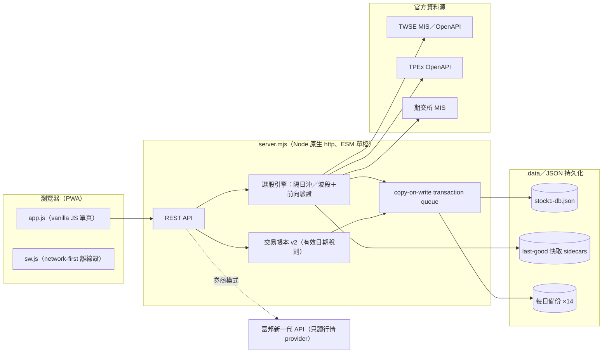

# stock-cockpit — 台股看盤終端 Web App

    

自架的台股看盤工作台（內部代號 Stock1）：整合 TWSE／TPEx／期交所官方資料，提供隔日沖與波段兩套選股引擎（含每日前向驗證）、技術分析、注意／處置看板、自選股與到價提醒，以及費稅完整的交易帳本。**無框架**——後端是單檔 Node 原生 `http`（`server.mjs`），前端是 vanilla JS 單頁（`app.js`），執行期依賴只有富邦行情 SDK 一個。

> 個人研究工具，僅供行情觀察與策略研究，不提供下單功能，所有訊號與估算都不構成投資建議。

## 畫面

| 隔日沖訊號＋前向驗證成績單 | 策略雷達（波段選股） |
|---|---|
|  |  |

| 技術分析 | 處置看板 |
|---|---|
|  |  |

| 盤中選股 | 手機版（PWA） |
|---|---|
|  |  |

## 架構



## 功能亮點

- **選股每天對答案**：隔日沖與波段訊號都有前向驗證成績單，只有官方收盤資料完整對齊才凍結正式快照；盤中結果標示暫定、不寫入長期統計。
- **交易帳本 v2**：商品與交易型態分開建模，依成交日套用有效日期化證交稅規則，估算值與券商實際值分離，歷史損益一旦凍結不被回改。
- **持久化走 copy-on-write transaction queue**：draft 隔離、原子落盤後才發布新快取；失敗回 `503`，不會出現「回成功但只存在記憶體」的狀態；多實例以 writer lease 互斥。
- **資料品質誠實降級**：各官方來源維護 last-good 快取，單一市場失敗仍回傳其餘資料並附 `warnings`／`dataQuality`；估算、待覆核、官方確認三種狀態在 UI 明確區分。
- **全離線測試套件**（`node:test`＋jsdom，零網路 mock 上游）＋ PWA network-first 離線殼，`/api` 永不快取，不會把舊行情冒充即時資料。

## AI 協作開發方式

專案由我與 coding agent 協作完成，過程中使用過的模型包含 **Claude Fable 5、Claude Opus 5、GPT-5.5、GPT-5.6**。

協作規範以一組專案 skill 文件維護（架構地圖、後端與前端規範、選股域規則、測試規範、上游資料源陷阱），agent 動手前需先讀對應的那一份；另有稽核文件記錄歷次發現、修復與驗證基線。這些文件保留在本機、不隨 repo 發佈。

開發鐵律：**疑似 bug 先回報、不默默改行為**；**測試釘住現行行為**，任何程式改動都要附離線測試，並以「突變抽查」（暫時把產品碼改回舊行為、確認測試真的轉紅）驗證測試有效；**行為變更必須在交付說明中明列**，改變選股結果這類決策一律先確認再動手。

## 本機啟動

需要 Node.js 20.19+、22.13+ 或 24+。

```powershell
npm install
npm start
```

開啟 `http://127.0.0.1:5174/`，第一次啟動會自動建立管理者帳號 `admin` / `admin1234`（**部署前務必用環境變數改掉**）。

```powershell
npm test          # 離線測試套件（不需網路）
npm run test:live # opt-in：真實上游形狀檢查
```

## 環境變數

```text
NODE_ENV=production
HOST=0.0.0.0
PORT=5174
APP_SECRET=長且不可外流的隨機字串（用來加密券商 API 設定，正式使用後不要更換）
ADMIN_USERNAME=admin
ADMIN_PASSWORD=強密碼
PUBLIC_ORIGIN=https://你的正式網域
COOKIE_SECURE=true
DATA_DIR=/var/app/data
DB_PATH=/var/app/data/stock1-db.json   # 可省略，預設 DATA_DIR/stock1-db.json
```

`NODE_ENV=production`，或即使不是 production 但對外綁定（`HOST=0.0.0.0`／設定 `PUBLIC_ORIGIN`）時，會強制要求高強度密碼與 `APP_SECRET`，並拒絕範例值。

## API 概覽

唯讀端點（行情、指數、隔日沖／波段訊號、法人、技術分析、處置看板等）未登入即可用；會修改個人或共享資料的端點需要登入，未登入回 `401`。

| 分類 | 端點 |
|---|---|
| 服務健康 | `GET /api/health` |
| 帳號 | `/api/auth/*`、`/api/admin/users` |
| 行情與大盤 | `/api/quotes`、`/api/markets`、`/api/technical-analysis`、`/api/institutional`、`/api/margin`、`/api/fundamentals` |
| 選股引擎 | `/api/overnight*`、`/api/swing*`、`/api/backtest/overnight` |
| 處置看板 | `/api/surveillance-board` |
| 個人資料（需登入） | `/api/watchlists`、`/api/alerts`、`/api/trades`、`/api/personal-data/*`、`/api/broker/*` |

交易帳本採 `schemaVersion: 2`，`rev` 樂觀鎖防多分頁蓋寫；個人資料可從「更多 → 個人資料備份」匯出 JSON 備份，並透過兩階段預覽式流程復原。完整端點行為與費稅規則見 [server.mjs](server.mjs)。

## 資料來源

官方模式使用 TWSE MIS／OpenAPI、TPEx OpenAPI，以及官方注意股、處置股、全額交割與除權息資料。各來源維護 last-good 快取，單一市場暫時失敗時回傳其餘可用資料並附品質警告，不會用不完整或日期未對齊的資料建立正式選股／驗證樣本。券商模式目前支援富邦新一代 API（只讀行情），失敗時自動退回官方來源。

## 私人雲端使用方式

1. 部署到可提供 HTTPS 的小額雲端服務，設定 `HOST=0.0.0.0`、`COOKIE_SECURE=true`、`APP_SECRET`、`ADMIN_PASSWORD`、`PUBLIC_ORIGIN`。
2. 用管理者帳號登入，到「更多 → 系統設定」建立你和朋友的帳號。
3. 每個人用自己的手機打開同一個網址登入，各自管理自選股、資料來源與券商 API 設定。

## 券商 API

第一版只支援富邦新一代 API 的只讀行情——不接下單、不接改單、不讀庫存、不讀帳務。憑證與密碼只存在後端資料庫並以 `APP_SECRET` 加密；前端不會回填。

## 安全注意

- 不要公開部署成任何人都能註冊的服務。
- 不要把 `APP_SECRET`、富邦密碼、憑證密碼提交到 Git。
- 不要把 `.data/` 資料庫資料夾交給朋友或上傳到公開 repo。
- 券商 API 第一版只做看盤，正式加交易功能前需要重新設計權限、稽核與風控。

## 免責聲明

本專案為個人研究與學習用途的行情觀察工具。所有選股訊號、驗證統計、費稅與損益估算僅供參考，不構成任何投資建議或要約；實際費稅以券商對帳單與主管機關公告為準。

## 授權

[MIT](LICENSE)。自架字型 IBM Plex Mono 依 [OFL 授權](fonts/LICENSE-IBM-PLEX.txt)；Lucide 圖示為 ISC 授權。
